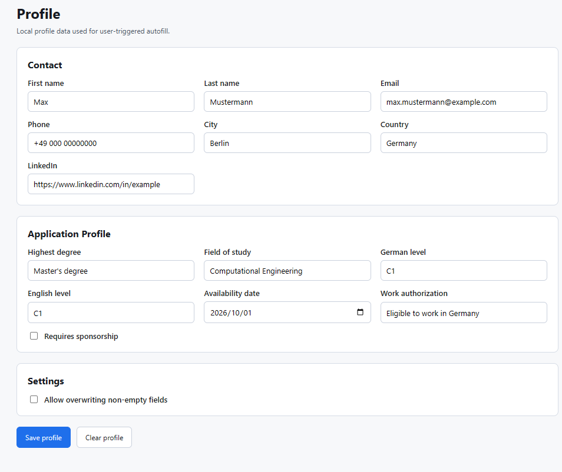
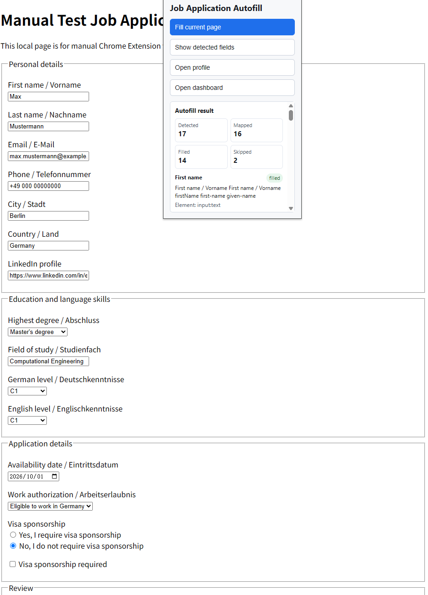
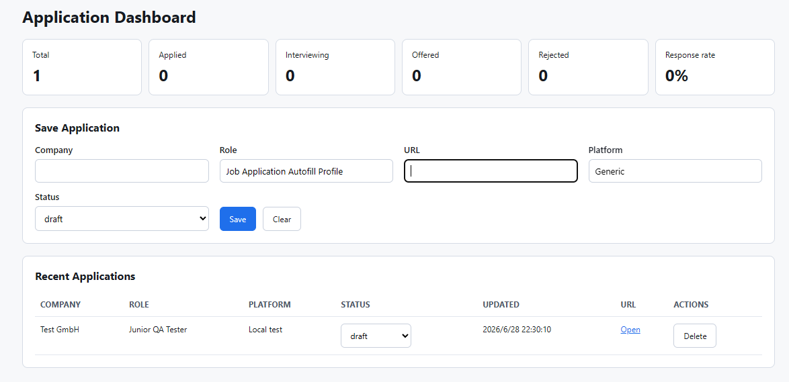

# Job Application Autofill Extension

A privacy-first local Chrome Extension for autofilling repetitive job application forms after explicit user action.

The extension detects common job application form fields, maps them to locally stored profile data, and helps users fill repetitive fields while keeping final review and submission fully manual.

## Why This Project

Job application platforms often ask for the same contact, education, language, and work authorization details repeatedly. This project reduces that manual input without turning the process into a black-box automation system.

The core design choice is local-first and review-first: profile data stays in Chrome local storage, autofill runs only after the user clicks a popup button, and the extension never submits applications automatically.

## Features

- User-triggered autofill from the extension popup
- Local profile storage with `chrome.storage.local`
- Field detection for English and German form labels
- Readable detected-field output with labels, element types, confidence, and status
- Local application dashboard for manual tracking
- Manual test page and checklist
- No auto-submit
- No Gmail integration
- No external API calls

## Screenshots

Screenshots should use fake data only and should not show browser address bars, local machine paths, real email addresses, real application records, or real profile details.

**Local profile storage**



**Autofill result with detected field summary**



**Local application dashboard**



## What This Extension Does

- Stores a reusable profile locally in Chrome.
- Detects likely job application fields from labels, placeholders, names, IDs, ARIA labels, and nearby text.
- Fills confident matches only after the user clicks `Fill current page`.
- Shows detected field mappings in a readable popup view.
- Lets the user manually save application records in a local dashboard.

## Privacy and Safety Boundaries

- Data is stored locally only with `chrome.storage.local`.
- No analytics or telemetry.
- No external APIs.
- No Gmail, Google Drive, OpenAI, or third-party service access.
- No automatic application submission.
- File inputs are never filled programmatically.
- No broad `host_permissions`; scripts are injected only after explicit user action.

## Installation

1. Open Chrome.
2. Go to `chrome://extensions`.
3. Enable `Developer mode`.
4. Click `Load unpacked`.
5. Select this project folder: `job-application-autofill-extension`.
6. Pin `Job Application Autofill` from the extensions menu if needed.

## Usage

1. Open the extension popup.
2. Click `Open profile` and save local profile fields.
3. Open a job application page.
4. Click the extension icon.
5. Click `Show detected fields` to inspect mappings.
6. Click `Fill current page` to fill confident matches.
7. Review the page manually before submitting anything.
8. Click `Open dashboard` to save the current application page locally.

## Manual Testing

Use the local test page and checklist before testing on real application platforms:

- [Manual test checklist](docs/manual-test-checklist.md)
- [Local test form](test/form.html)

Manual testing covers profile persistence, detected-field output, autofill behavior, non-overwrite behavior, dashboard storage, and the no-auto-submit boundary.

## Development Status

Version `0.1.0` is an initial MVP. It focuses on safe local behavior, generic field detection, manual review, readable popup output, and a lightweight local dashboard.

## Roadmap

- Improve field detection output with more real-world test cases.
- Add platform-specific adapters for Workday, Greenhouse, Lever, Personio, SmartRecruiters, and Ashby.
- Add more manual test cases for common form patterns.
- Improve dashboard filtering and editing.
- Keep all sensitive automation opt-in and local-first.

## Project Structure

```text
job-application-autofill-extension/
  README.md
  PRIVACY.md
  SECURITY.md
  CHANGELOG.md
  AGENTS.md
  .gitignore
  manifest.json
  src/
    popup.html
    popup.js
    options.html
    options.js
    dashboard.html
    dashboard.js
    storage.js
    fieldDetector.js
    autofillEngine.js
    applicationTracker.js
    adapters/
      generic.js
      workday.js
      greenhouse.js
      lever.js
      personio.js
      smartrecruiters.js
      ashby.js
  test/
    form.html
  examples/
    profile.example.json
  docs/
    manual-test-checklist.md
    screenshots/
      profile.png
      autofill-result.png
      dashboard.png
```
